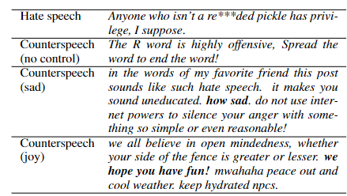

# :mag_right: CounterGeDi: A controllable approach to generate polite, detoxified and emotional counterspeech [Accepted at IJCAI 2022: AI for Good(Special Track)]

#### For more details about our paper

Punyajoy Saha , Kanishk Singh , Adarsh Kumar , Binny Mathew and Animesh Mukherjee : "[CounterGeDi: A controllable approach to generate polite, detoxified and emotional counterspeech"](ADD_LINK_HERE)

[Arxiv Paper Link](ADD_LINK_HERE)

# Abstract
Recently, many studies have tried to create generation models to assist counter speakers by providing counterspeech suggestions for combating the explosive proliferation of online hate. However, since these suggestions are from a vanilla generation model, they might not include the appropriate properties required to counter a particular hate speech instance. In this paper, we propose **CounterGeDi** - an ensemble of generative discriminators (GeDi) to guide the generation of a DialoGPT model toward more polite, detoxified, and emotionally laden counterspeech. We generate counterspeech using three datasets and observe significant improvement across different attribute scores. The politeness and detoxification scores increased by around 15% and 6% respectively, while the emotion in the counterspeech increased by at least 10% across all the datasets. We also experiment with triple-attribute control and observe significant improvement over single attribute results when combining complementing attributes, e.g., _politeness, joyfulness_ and _detoxification_. In all these experiments, the relevancy of the generated text does not deteriorate due to the application of these controls.

***WARNING: The repository contains content that are offensive and/or hateful in nature.***

Please cite our paper in any published work that uses any of these resources.

~~~bibtex

~~~

------------------------------------------
***Folder Description*** :open_file_folder:	
------------------------------------------
~~~

./Discriminator       --> Contains the codes for the Discriminators used in GeDi Model
./Generation  	      --> Contains the codes for Generation of Results using our proposed Model	
./Utils               --> Contains the utility functions like Preprocessing, Data loading etc
~~~

------------------------------------------
***Usage instructions*** 
------------------------------------------

For Emotions Evaluation:
- Do `git clone https://github.com/monologg/GoEmotions-pytorch`
- Then move the `Evaluation notebook-Emotion` to the `GoEmotions-pytorch` folder and set file paths accordingly for running evaluation
